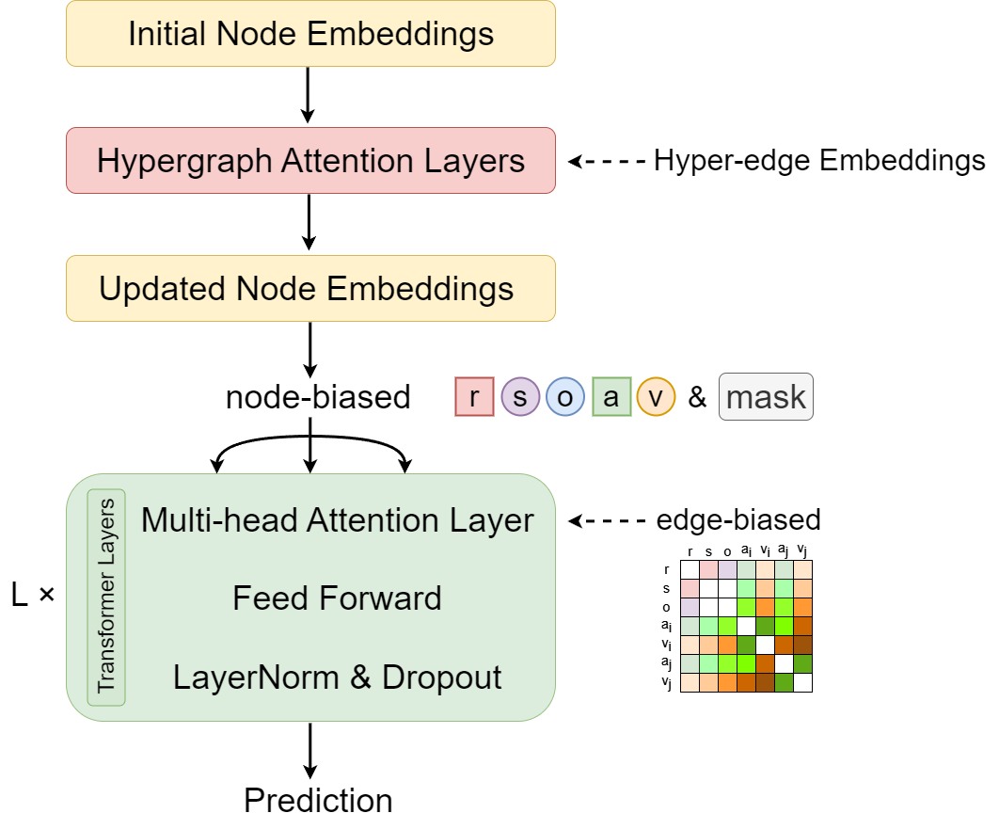

# Heterogeneous Graph Structure Learning Based Link Prediction in Knowledge Hypergraphs

## Overview

Current research on the structural learning of hyper-relational facts is limited and has not fully captured the intrinsic connections between various facts. To address this issue, we propose a hyper-relational representation method based on **HET**erogeneous graph structure **L**earning (**HETL**), which effectively captures the semantic information of hyper-relational facts and improves link prediction performance. In the experimental section, we use common benchmark datasets for hyper-relational facts and compare our model with baseline methods. The results demonstrate that our model achieves certain superiority in performance metrics. 

## The model framework of HETL



## Requirements

The project environment installation commands are as follows:

`conda create -n hetl python=3.9 -y`

`conda activate hetl`

`conda install pytorch pytorch-cuda=11.8 -c pytorch -c nvidia`

`pip install numpy==1.23.3`

`pip install tqdm==4.66.5`

`pip install torch==2.4.0`

`pip install torch_geometric==2.5.3`

## Experiments

### Datasets

We conducted experiments on a hyperrelational dataset, which includes [JF17K](https://www.dropbox.com/scl/fo/684syl42ep9fhfmjg8d2j/AGTsm9mS9LEViSdckg6hO00?rlkey=rbqj742cfcm20baj1b2y9si52&e=1&dl=0) and WikiPeople-. JF17K is extracted from Freebase; WikiPeople- is extracted from [WikiPeople](https://github.com/gsp2014/WikiPeople), which is derived from Wikidata.

### Running the code

For JF17K, run the command with the following hyperparameters:

```
python -u ./src/run.py --dataset "jf17k" --vocab_size 29148 --vocab_file "./data/jf17k/vocab.txt" --train_file "./data/jf17k/train.json" --test_file "./data/jf17k/test.json" --ground_truth_file "./data/jf17k/all.json"  --num_relations 501 --max_seq_len 11 --max_arity 6 --num_workers 1 --hidden_dim 256 --hyper_layers 2 --hyper_dropout 0.2 --hyper_activation "relu" --hyper_heads 4 --trans_layers 12 --trans_dropout 0.2 --trans_heads 4 --decoder_activation "relu" --batch_size 1024 --lr 5e-4 --weight_decay 0.01 --entity_soft 0.2 --relation_soft 0.0 --hyperedge_dropout 0.9 --epoch 300 --warmup_proportion 0.05 --device "0"
```

For Wikipeople-, run the command with the following hyperparameters:

```
python -u ./src/run.py --dataset "wikipeople-"--vocab_size 35005 --vocab_file "./data/wikipeople-/vocab.txt" --train_file "./data/wikipeople-/train+valid.json" --test_file "./data/wikipeople-/test.json" --ground_truth_file "./data/wikipeople-/all.json" --num_relations 178 --max_seq_len 13 --max_arity 7 --num_workers 1 --hidden_dim 256 --hyper_layers 2 --hyper_dropout 0.1 --hyper_activation "elu" --hyper_heads 4 --trans_layers 12 --trans_dropout 0.1 --trans_heads 4 --decoder_activation "gelu" --batch_size 1024 --lr 5e-4 --weight_decay 0.01 --entity_soft 0.2 --relation_soft 0.1 --hyperedge_dropout 0.9 --epoch 300 --warmup_proportion 0.05 --device "0"
```

For JF17K-3, run the command with the following hyperparameters:

```
python -u ./src/run.py --dataset "jf17k-3" --vocab_size 11751 --vocab_file "./data/jf17k-3/vocab.txt" --train_file "./data/jf17k-3/train+valid.json" --test_file "./data/jf17k-3/test.json" --ground_truth_file "./data/jf17k-3/all.json"  --num_relations 208 --max_seq_len 5 --max_arity 3 --num_workers 1 --hidden_dim 256 --hyper_layers 2 --hyper_dropout 0.2 --hyper_activation "relu" --hyper_heads 4 --trans_layers 12 --trans_dropout 0.2 --trans_heads 4 --decoder_activation "relu" --batch_size 1024 --lr 5e-4 --weight_decay 0.01 --entity_soft 0.2 --relation_soft 0.0 --hyperedge_dropout 0.9 --epoch 300 --warmup_proportion 0.05 --device "0"
```

For JF17K-4, run the command with the following hyperparameters:

```
python -u ./src/run.py --dataset "jf17k-4" --vocab_size 6607 --vocab_file "./data/jf17k-4/vocab.txt" --train_file "./data/jf17k-4/train+valid.json" --test_file "./data/jf17k-4/test.json" --ground_truth_file "./data/jf17k-4/all.json"  --num_relations 69 --max_seq_len 7 --max_arity 4 --num_workers 1 --hidden_dim 256 --hyper_layers 2 --hyper_dropout 0.2 --hyper_activation "relu" --hyper_heads 4 --trans_layers 12 --trans_dropout 0.2 --trans_heads 4 --decoder_activation "relu" --batch_size 1024 --lr 5e-4 --weight_decay 0.01 --entity_soft 0.2 --relation_soft 0.0 --hyperedge_dropout 0.9 --epoch 300 --warmup_proportion 0.05 --device "0"
```

For Wikipeople-3, run the command with the following hyperparameters:

```
python -u ./src/run.py --dataset "wikipeople-3"--vocab_size 12384 --vocab_file "./data/wikipeople-3/vocab.txt" --train_file "./data/wikipeople-3/train+valid.json" --test_file "./data/wikipeople-3/test.json" --ground_truth_file "./data/wikipeople-3/all.json" --num_relations 112 --max_seq_len 5 --max_arity 3 --num_workers 1 --hidden_dim 256 --hyper_layers 2 --hyper_dropout 0.1 --hyper_activation "elu" --hyper_heads 4 --trans_layers 12 --trans_dropout 0.1 --trans_heads 4 --decoder_activation "gelu" --batch_size 1024 --lr 5e-4 --weight_decay 0.01 --entity_soft 0.2 --relation_soft 0.1 --hyperedge_dropout 0.9 --epoch 300 --warmup_proportion 0.05 --device "0"
```

For Wikipeople-4, run the command with the following hyperparameters:

```
python -u ./src/run.py --dataset "wikipeople-4"--vocab_size 9625 --vocab_file "./data/wikipeople-4/vocab.txt" --train_file "./data/wikipeople-4/train+valid.json" --test_file "./data/wikipeople-4/test.json" --ground_truth_file "./data/wikipeople-4/all.json" --num_relations 95 --max_seq_len 7 --max_arity 4 --num_workers 1 --hidden_dim 256 --hyper_layers 2 --hyper_dropout 0.1 --hyper_activation "elu" --hyper_heads 4 --trans_layers 12 --trans_dropout 0.1 --trans_heads 4 --decoder_activation "gelu" --batch_size 1024 --lr 5e-4 --weight_decay 0.01 --entity_soft 0.2 --relation_soft 0.1 --hyperedge_dropout 0.9 --epoch 300 --warmup_proportion 0.05 --device "0"
```

## Acknowledge

The code framework is derived from https://github.com/LHRLAB/HAHE. We would like to appreciate their open-sourced work.